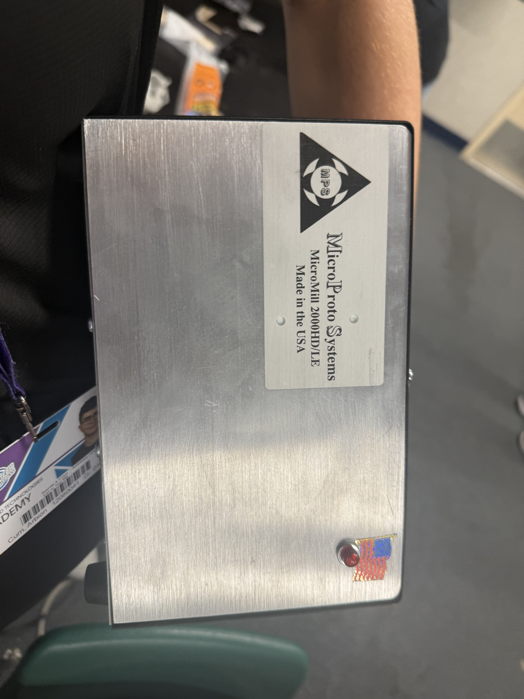
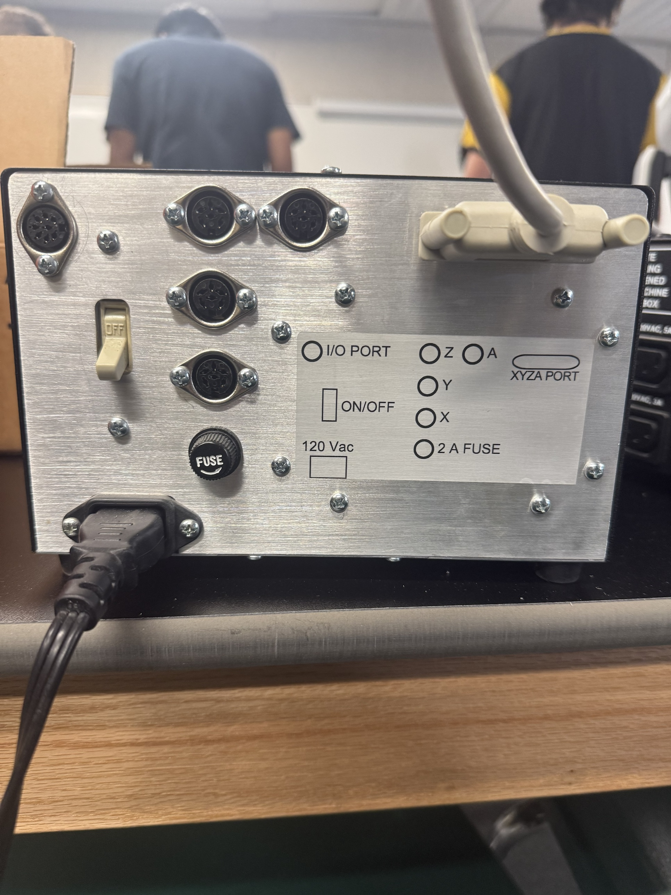
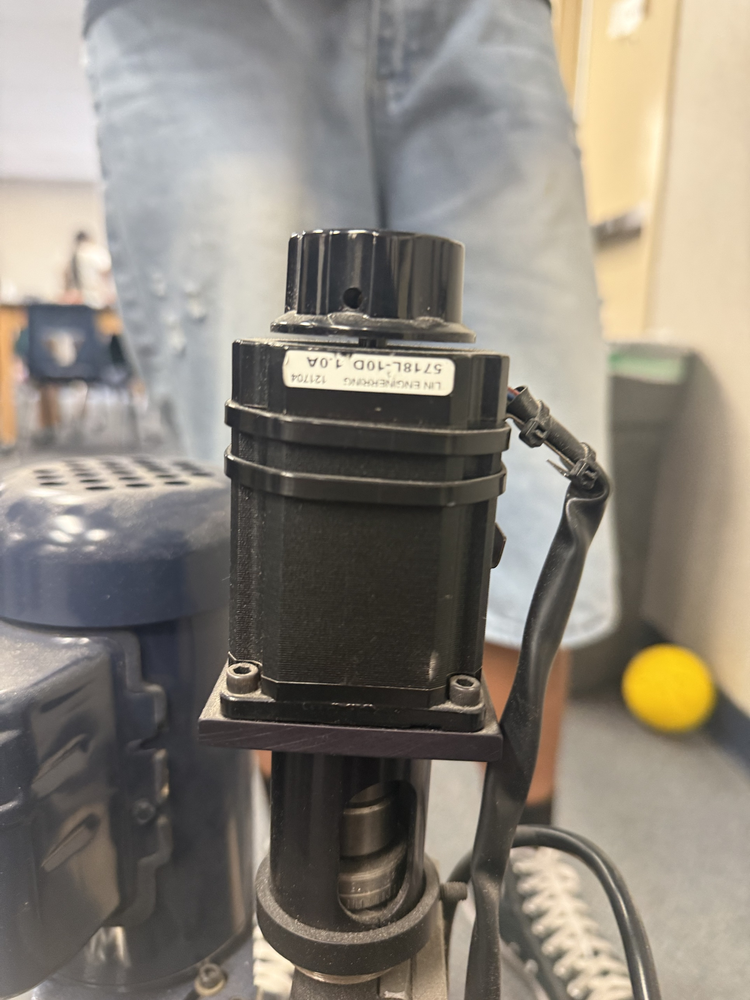
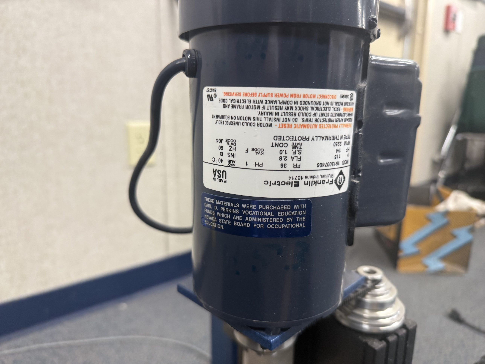
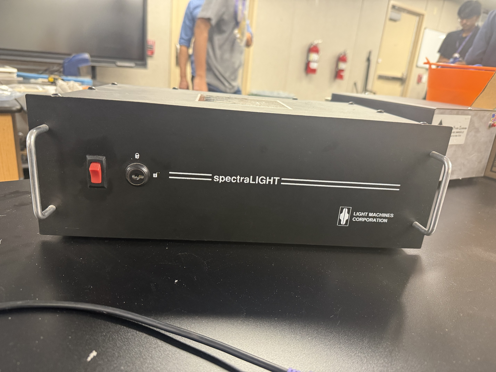
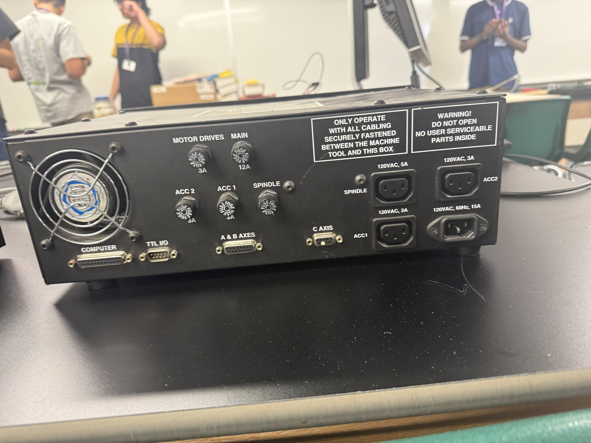
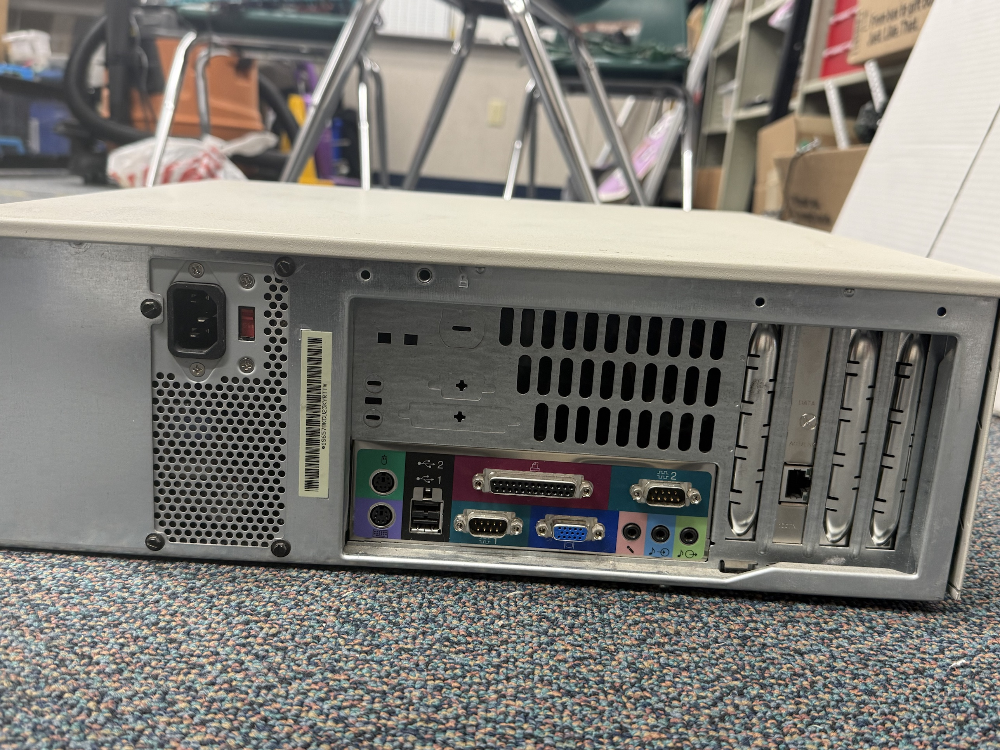
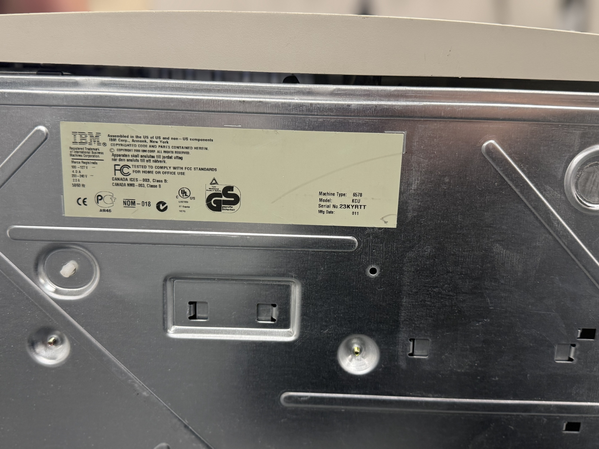

# Project Journal

Running log of findings and decisions for the A-Tech CNC machine
replacement-software project. Read this first if you're picking this
project up after a gap — it exists so nothing has to be re-discovered
from scratch.

## Goal

Build a modern replacement for the discontinued software that used to
program/run the school's CNC mill. Requirements set by the project owner
so far:

- A native desktop application (explicitly **not** a web page/browser UI —
  compared to Bambu Studio as the reference for feel).
- Target OS: **Windows 11** on modern PC hardware.
- No phone/companion app — desktop only.
- Needs to both (a) send G-code/cutting jobs to the machine, and
  (b) be the path for "updating" the machine's control electronics.
- **Standing safety requirement (2026-09-22, owner's explicit
  instruction): a job must never be able to start running on the
  machine without a person physically present to confirm it.** This
  applies at every phase of the project, not just the current
  workaround — including after the eventual full hardware retrofit.
  Software must never support fully unattended/remote job starts; a
  physical confirmation step at the machine is mandatory every time.

## Hardware identified (as of 2026-09-17)

The machine is a small educational benchtop CNC mill, likely purchased
with Carl D. Perkins Vocational Education funds (Nevada). Three main
pieces of original equipment:

1. **Mill mechanics**: badged **MicroProto Systems "MicroMill 2000HD/LE"**
   (MicroProto is a spin-off of Taig Tools). Axis motors are standard
   **Lin Engineering 5718L-10D, 1.0A NEMA 23 steppers**. Spindle is a
   separate **Franklin Electric 1/4 HP 115V AC induction motor**
   (3450 RPM) — not part of the precision motion system, just on/off.
   A silver interface panel (mounted on/near the mill) exposes DIN-style
   connectors labeled `X`, `Y`, `Z`, `A`, an `I/O PORT`, and an
   `XYZA PORT`.

   
   
   
   

2. **Controller/driver box**: badged **Light Machines Corporation
   "spectraLIGHT"** (Light Machines was later acquired by **Intelitek**).
   This is the box with all the fused power distribution (`MOTOR DRIVES`,
   `MAIN`, `SPINDLE`, `ACC1`, `ACC2`) and connectors: `A & B AXES` (DB15),
   `C AXIS` (DB9), `TTL I/O` (DB9), and — the important one —
   **`COMPUTER` (DB25)**. Warning label says "do not open, no user
   serviceable parts inside."

   
   

   **Updated theory, revised 2026-09-22 — likely NOT connected to the
   MicroProto mill at all.** Cross-checked both full manuals directly:
   neither mentions the other company's product anywhere. More
   tellingly, the spectraLIGHT manual's own interconnection diagram
   shows its `A & B AXES`/`C AXIS` ports are designed for **15-pin and
   9-pin D-sub cables** going to Light Machines' own "machining center"
   — a completely different connector shape than the **round DIN**
   connectors on the MicroProto axis panel. Combined with the
   `Params.dat` finding below (MPS2003 talks to plain PC parallel-port
   hardware; the spectraLIGHT box needs its own proprietary ISA card —
   mutually unintelligible protocols), the working conclusion is that
   this spectraLIGHT box is a **leftover from a separate, different
   Light Machines mill/lathe** (possibly no longer present), not
   actually part of this MicroMill's functioning signal path. A cable
   was found plugged into its `COMPUTER` port, but its other end hasn't
   been traced yet — doing so would make this certain either way, but
   isn't currently treated as blocking given the strength of the manual
   evidence above.

3. **Original computer**: an **IBM NetVista** (Machine Type 6578, Model
   KCU, manufactured ~2001, Pentium III/4 era). Back panel has exactly
   one **DB25 parallel port** + two DB9 serial ports (COM1/COM2), PS/2,
   early USB, VGA. **Currently still boots to Windows 95** (per owner,
   2026-09-17). A previous, unsuccessful repair attempt by others wanted
   to move this machine to Linux instead.

   
   

   Not yet checked: whether the original CNC software (MicroProto's
   MPS2000/MPS2003 DOS CAM program, and/or Light Machines' spectraLIGHT
   software) is still installed on this Win95 drive. **This should be
   checked before the drive is touched/wiped** — if the software's still
   there, it's a goldmine now that the original manuals are confirmed
   lost.

   Ruled out: a small 12V DC air pump + generic "Power Charger" 12V/5A
   adapter found nearby is **unrelated** to the CNC system (no branding
   or wiring tying it in) — this machine has no pneumatics at all, fully
   electric (steppers + AC spindle motor only).

## MicroMill 2000 manual (MPS2003 software) — now read in full

The owner uploaded this one and it could be read directly (had to install
`poppler-utils` in the sandbox first — noted here in case a future session
hits the same "pdftoppm not installed" error). It's a **software/user
manual for the original MPS2003 DOS program**, not a hardware/wiring
manual, so it doesn't contain a DB25 pin table — but it confirms and adds
important detail:

- **Confirms direct parallel-port bit-banging**, exactly as theorized.
  MPS2003 talks straight to PC hardware I/O ports: the XYZ axes are
  addressed at port base **888 decimal (0x378 — the standard LPT1
  address)**, and there's an optional **4th axis ("A") printer port
  card at 632 decimal (0x278 — standard LPT2)**, supplied specifically
  with the rotary-table option. So a machine with the 4th axis installed
  would need *two* parallel ports on the PC — worth checking whether this
  particular PC ever had a second LPT card, since its back panel (per
  photos) only showed one DB25.
- Confirms a separate **"driver unit"** (amplifier hardware, distinct
  from the PC) takes those raw parallel signals and drives the actual
  stepper motors. Explicitly warned in the troubleshooting section: the
  driver unit must stay under continuous software control or it
  overheats — "DO NOT leave the driver unit on if it is not under
  control of the software." Confirms troubleshooting for "motors just
  vibrate" points at the printer cable/port, not a smarter protocol.
- **Motion calibration constants**, useful later for configuring
  whatever retrofit board we land on: 20 rev/inch lead screw, 1.8°/step
  motors, half-stepping → **8000 steps/inch** (0.000125 in/step) as the
  factory default; the manual also shows how to fine-tune this
  (e.g. 7992 steps/inch) if a given lead screw's true pitch varies
  slightly.
- **Original G-code dialect supported by MPS2003** (useful if we ever
  find old job files, and as a sanity baseline — our new software isn't
  required to match this, since we're not reusing this program):
  `G00 G01 G02 G03 G17 G20 G21 G43 G81 G83 G98 G99` and
  `M02 M97 M99`. Fairly minimal/classic subset — notably no explicit
  G90/G91 mention found, no tool-change M-codes, no canned pattern
  cycles beyond drilling/peck-drilling.
- No mention anywhere of Light Machines or spectraLIGHT — consistent
  with the theory that the spectraLIGHT box was a **later replacement**
  for MicroProto's original driver unit + MPS2003 combo, not part of the
  machine's original design.

**Still missing**: the actual DB25 pin assignments for whichever
box/driver unit is currently in the signal path. This manual didn't have
it — need the spectraLIGHT manual (see next section — now read, but it
turns out this doesn't have the pin table either) or a physical
trace/continuity check.

## spectraLIGHT Mill manual — now read in full (251 pages)

Owner sent this one as a zip (the PDF was too large to upload directly).
This is the **full official manual** — installation, the Windows 95
"Control Program" GUI, G-code reference, robotic I/O, safety, everything.
Confirms and substantially sharpens the picture:

- **The `COMPUTER` DB25 is not a parallel port at all — it's a
  dedicated ISA bus expansion card** ("the spectraLIGHT Interface Card"),
  installed in a full-size expansion slot inside the original PC. The
  manual explicitly warns installers: "Do not get the Interface Card
  mixed up with the parallel port which uses the same type of
  connector" — i.e. it just *looks* like a parallel port (same DB25
  shell) but is wired to the ISA bus, not the PC's built-in LPT hardware.
  Factory I/O address is **0x3A0** (reserved for Bisync cards on the
  classic PC/AT I/O address map), and there's a software panel in the
  Control Program to change this address if it conflicts with another
  card.
- This **removes all ambiguity about reusing the original PC-side
  hardware**: ISA slots don't exist on any PC made in the last ~20 years,
  full stop — not even as an option via a simple adapter. There was
  never a version of "keep the original interface, just get a new PC"
  that could have worked. This confirms the retrofit plan is the only
  viable path, not just the recommended one.
- **The manual does not publish a pin-level signal table for the DB25
  cable coming out of this Interface Card.** It's an end-user
  install/operate guide, not an engineering reference. So the
  secondhand forum pinout below is still our only lead on the actual
  signal assignments — not confirmed by a primary source yet.
- Also documented, for completeness: a separate 9-pin cable runs
  directly from the Interface Card to the machining center itself
  (spindle-related, bypasses the Controller Box), and the Controller
  Box connects to the machining center via a 15-pin `A & B AXES` cable
  and a 9-pin `C AXIS` cable. There's also a documented 9-pin `TTL I/O`
  / robotic accessory connector with its own pin table (inputs/outputs
  for external automation, ±5V/TTL levels, 1mA max output) — useful
  context, but it's for accessory integration, not the main axis drive
  signals.
- Confirms the currently-installed OS really is running the
  **spectraLIGHT Windows 95 GUI "Control Program"** (not the MicroProto
  MPS2003 DOS program) — so when the machine is powered on, look for a
  Windows program/folder actually named something like "spectraLIGHT"
  or "Control Program," not "MPS2003."

## Machine powered on — found the live MPSPRO installation (2026-09-22)

Owner got the Windows 95 machine booted (login dialog turned out to be
the classic Win9x non-enforcing logon — Cancel/blank credentials got
straight to the desktop, as expected). The desktop itself was stock/empty
(no CNC shortcuts), but `C:\MPSPRO` is **fully intact**:

```
Bolthole.tap  Ellipse.tap  Facef.tap  Facer.tap  Gear.tap  Knight.tap
Textdemo.tap  Install  Mill  Mps2003  Mpsm97  Mpsprob3
Param3.dat  Param51.dat  Param51s.dat  Paramp3.dat  Params.dat
Steptxt  Textm97
```

Two big findings from opening files here:

- **`Params.dat` confirms the real, working port addresses** — and they
  match the manual's documented *standard* values exactly, not the
  spectraLIGHT ISA card's address:
  ```
  0
  0
  0
  0
  888     <- XYZ port base = 0x378 = standard PC LPT1
  890
  632     <- A (4th axis) port base = 0x278 = standard PC LPT2
  600
  200
  10
  0
  16
  16
  0
  8
  INCH
  ```
  (First four `0`s are likely the last-saved X/Y/Z/A position, all
  homed/zeroed. The values after 632 are probably rapid-speed/backlash/
  step-mode settings per the manual's calibration section — not fully
  decoded, and not needed for our purposes. The `888`/`632` match is the
  important part.)

  **This is a significant update to the working theory.** It means the
  software actually configured and (presumably) used on this machine
  talks through the **PC's own built-in standard parallel port
  hardware** (LPT1, and LPT2 for the 4th axis) — not the spectraLIGHT
  Interface Card's proprietary ISA bus address (0x3A0) at all. That
  raises an open question we didn't have before: **is the spectraLIGHT
  box even the thing currently wired to this PC's parallel port**, or is
  the MicroProto native breakout box (the one with the round DIN X/Y/Z/A
  connectors) the one actually in the live signal path, with the
  spectraLIGHT box unused/legacy or wired in for something unrelated
  (e.g. just spindle control)? **Next time at the machine: physically
  trace the cable from the PC's DB25 parallel port to whichever box it
  actually plugs into** — this settles it conclusively either way.
  This is good news either way for the retrofit: a standard LPT1/LPT2
  step/dir setup is a well-understood, common target (this is exactly
  what generic hobby CNC breakout boards and GRBL-adjacent controllers
  already expect), more so than the spectraLIGHT ISA card scenario.

- **`Steptxt` is not a text file — it's a live DOS control program**
  ("MPSTEXT V3.0"), showing real-time axis position (X/Y/Z/A, all
  0.0000), feed rate, jog increment, and a manual jog / load program /
  run program / zero axis menu. **This is working control software that
  can actually move the machine** if the driver box and motors are
  powered and connected — treat it with the same care as running the
  original software for real. Owner was advised not to press any menu
  keys (Manual Jog, Run Program, Zero Axis) until the area around the
  mill is confirmed clear.

Not yet opened: `Param3.dat`, `Param51.dat`, `Param51s.dat`,
`Paramp3.dat` (other config variants — probably per-job or per-material
presets), `Mill` (separate program, purpose unknown), `Mps2003` /
`Mpsm97` / `Mpsprob3` (the actual control program executables — not run
yet, deliberately, until we're sure it's safe to do so with the machine
in its current physical state).

## Community research on the MicroProto controller itself (2026-09-22)

With the retrofit target now confirmed as the MicroProto side (not
spectraLIGHT), searched specifically for how the MicroProto controller
hardware works. Found a dedicated history/reference (a wiki page,
"Microproto Control System Versions" on medw.uk — blocked from direct
fetch in this sandbox, but reached via search snippets) plus several
forum threads. Key findings:

- **MicroProto controllers exist in (at least) two generations.** The
  **original** controller drives each stepper motor with a raw
  **3-wire phase control** signal straight from the PC's parallel
  port — not step/direction. Since 3 wires × 4 axes = 12 signals, more
  than one 8-bit parallel port's data lines can carry, the original
  design **needed two parallel ports** for a 4-axis setup (one for
  XYZ, a second for the 4th/A axis).
- **In 2003, MicroProto released a "step and direction" upgrade
  board** that sits between the PC and the original phase-drive cards,
  translating standard step/dir signals into the 3-wire phase pattern
  those cards actually need — this is what let later owners run
  standard software like Mach3 on old MicroProto hardware. A 2006
  variant added closed-loop encoder feedback.
- **A separate, still-sold commercial product does the same
  conversion**: the **TurboTaig board** (Homann Designs, ~AU$169,
  part# TC-01) — also converts the original 3-wire phase interface to
  standard step/direction, with bonus I/O (limit switch inputs, relay
  outputs for spindle/coolant, touch-probe and spindle-indexer
  support). Reviewed by real owners; one review reported running
  150,000 lines of G-code for 4 hours without a hitch. It exposes a
  step/dir input via a connector called `J9` for use with classic
  step/dir software (Mach1/Master5/TurboCNC/EMC-era programs, all of
  which historically ran on a PC with a real parallel port doing the
  real-time bit-banging — so this board still needs an external
  real-time-capable pulse source, it doesn't generate G-code motion
  itself).
- **This machine is almost certainly the original, pre-upgrade
  version** — `Params.dat`'s two port addresses (888 and 632) match
  the "needed two parallel ports" description of the *original*
  3-wire-phase controller, not the single-port step/dir upgrade.
- **Confirmation this matters in practice, not just theory**: a forum
  thread describes someone wiring a modern Centroid Acorn controller
  directly into an old MicroProto driver box's DB25 expecting standard
  step/dir — the axes only turned one step and needed direction
  toggling to move further, exactly the broken behavior you'd expect
  feeding step/dir pulses into hardware that actually wants raw
  phase-state signals. **A generic modern step/dir board cannot be
  wired straight into this old driver box.**
- Bonus, found real pinout detail for the panel's **`I/O PORT`**
  connector (separate from the axis motor connectors): pins 1–4 are 3
  limit switches + E-stop, pin 5 is an optional 4th-axis limit switch,
  pin 8 is ground/common return.

**Revised retrofit pipeline** (updates the "Decision: retrofit plan"
section below): Windows 11 PC → a small GRBL-based board (generates
real step/dir pulses in hardware) → a **TurboTaig board** (or
MicroProto's own official 2003 upgrade board, if one can be sourced)
converting those to the 3-wire phase pattern → the **existing original
MicroProto driver cards** (unchanged) → motors. This replaces
"reverse-engineer the 3-wire phase pinout ourselves" with "buy an
existing, tested product that already solves exactly this problem" —
a meaningfully lower-risk plan.

## Key technical finding: why this can't just move to a new Windows PC as-is

Web research (see Sources below) turned up a secondhand pinout for the
spectraLIGHT `COMPUTER` DB25 port — it's a **plain step/direction
parallel-port breakout**, functionally the same scheme used by
Mach3/TurboCNC-era hobby CNC controllers:

```
Pin 22: Enable          Pin 6:  X Direction     Pin 21: X Step
Pin 18: Y Direction     Pin 20: Y Step          Pin 5:  Z Direction
Pin 19: Z Step          Pin 17: Enable          Pin 4:  Spindle On
Pin 23: E-Stop          Pin 13: Home            Pin 24: Limit
Pin 1:  Accessory       Pin 11: Cover           Pin 2:  Chuck
Pin 7:  Ground
```
(**Still not verified against a primary source** — neither manual we've
read has it; see Open Items. It's plausible this is still roughly right
even though we now know it's an ISA card rather than a plain parallel
port — a lot of ISA-era motion cards just used the bus to receive fast
register writes from the CPU and then output plain TTL step/dir pulses
on their external connector — but "plausible" isn't "confirmed.")

Also found: the spectraLIGHT needs "an LPT card with a strong 5V
output — a 3.3V card will not work" — this actually lines up with the
"ISA card, not the parallel port" finding above; the forum poster was
likely describing the same Interface Card, imprecisely.

Put together with the Windows-95-was-the-original-OS fact: this old
setup relied on the PC itself bit-banging real-time step pulses out the
parallel port, something Win95's minimal task-switching allowed, but
which modern OSes (Windows 11 included — this is *worse* than even
Windows XP/7 for this purpose) cannot do reliably. This is the same
reason the earlier would-be fixers wanted to switch to Linux
(a real-time-patched Linux kernel, à la LinuxCNC, is the traditional fix
for restoring that low-jitter timing) — same problem, different fix.

## Decision: retrofit plan

**Updated 2026-09-22 (twice)**: first to reflect that the spectraLIGHT
box is very likely not part of this machine's actual signal path (the
retrofit target is the **MicroProto side only**), then again after the
community research above revealed the MicroProto driver box likely
uses **raw 3-wire phase control per motor, not step/direction** — a
generic modern step/dir board cannot be wired straight into it (a
forum report of someone trying exactly that produced broken,
one-step-only motion).

Rather than fight for real-time performance on a general-purpose PC OS
(what both Win95-original and the Linux-retrofit idea were doing), the
plan is to remove the real-time requirement from the PC entirely — and
rather than reverse-engineer the old 3-wire phase protocol ourselves,
use an existing product built for exactly this conversion:

1. Keep the mechanical mill, the NEMA 23 steppers, the spindle motor,
   and the **original MicroProto driver cards** (the ones doing 3-wire
   phase drive) completely unchanged.
2. Add a **TurboTaig board** (Homann Designs, ~AU$169, part# TC-01 —
   or MicroProto's own official 2003 step/dir upgrade board, if one
   can still be sourced) between the driver cards and everything else.
   This is a real, tested product that converts standard step/direction
   signals into the 3-wire phase pattern the old driver cards expect —
   solving the exact problem we'd otherwise be reverse-engineering.
3. Feed that board's step/dir input (its `J9` connector, per the one
   review found) from a small, modern, well-documented motion-control
   board (GRBL-based controller is the leading candidate — cheap, open
   protocol, huge community) that generates the actual real-time
   step/dir pulses in hardware.
4. The Windows 11 PC just streams G-code over USB to the GRBL board at
   non-time-critical speed — no real-time requirement on the PC at all.
5. The spectraLIGHT box remains set aside as out of scope for this
   retrofit unless a cable trace (still not done, no longer treated as
   blocking) reveals it actually is in the path after all.

**Still to confirm**: whether this specific machine already has *any*
step/dir upgrade board installed (TurboTaig, MicroProto's own, or the
2006 closed-loop variant) rather than being fully original — this
would change or even eliminate the need to buy one. Check the driver
box/cards for a board matching either product before ordering
anything.

## Plan revised again (2026-09-22): test-first, "receiver" phase before hardware retrofit

Owner paused the hardware retrofit track above (not abandoned — just
sequenced later) in favor of proving the machine still works at all
first, then getting *something* usable running sooner. New sequence:

**Phase 0 — verify the machine still physically works**, using the
*original* MPS2003 software, unmodified, on the existing Win95 PC:
test-cut a piece of acrylic. Safety procedure (from the MPS2003 manual
itself, which documents exactly this workflow): move each axis by hand
with power off first to check for binding; mount a plastics-appropriate
cutter; secure the stock firmly; use the manual's own **Preview, then
Dry Run** steps before any real cut; start with the simplest possible
test job (a shallow face or small engraving, not a full cutout).

**Phase 1 — Windows 11 app as a G-code *importer/sender*, old PC stays
as the executor ("receiver")**, deferring the full hardware retrofit:
- **Revised again 2026-09-22**: owner dropped the username/password
  requirement — acceptable specifically because the link is a private,
  isolated point-to-point Ethernet cable between only these two
  machines (not the school's shared network), so there's no one else
  who could reach it to send a bogus file. Simpler receiver program as
  a result: just accepts an incoming G-code file and saves it, no auth
  handshake.
- **Also revised: the app's job is import + preview + send, not
  building G-code from scratch.** Owner wants it to accept G-code files
  created on *any* computer in the school (using whatever free/existing
  CAM software someone already has), so students/staff aren't forced to
  design everything inside our app. The app should validate that an
  imported file only uses commands MPS2003 actually understands
  (`G00 G01 G02 G03 G17 G20 G21 G43 G81 G83 G98 G99`, `M02 M97 M99` —
  see the MicroMill manual section above) and warn on anything
  unsupported, then preview the toolpath before sending. Building a
  from-scratch CAD/CAM design tool is explicitly *not* required for
  this phase — native G-code generation could still be a nice-to-have
  later, but importing existing files is the priority.
- Getting the file to the old PC: owner wants this over a network
  connection rather than physically carrying a floppy disk over.
  **Decided against joining the actual school WiFi/network** — Windows
  95 has no wireless hardware/driver support for any modern
  WPA2/WPA3-secured network, and even over wired Ethernet, the OS has
  no security patches ever, so exposing it to the school's shared
  network is a real risk most IT departments would (rightly) block.
  **Instead: a private, isolated, direct link between just the two
  computers** (a single Ethernet cable, or a small dedicated switch
  with only these two machines on it) — no other device can reach it,
  since it's not part of the school's network at all. Still need to
  check what network adapter is actually in the old PC (owner says it
  already has a WiFi/Ethernet card — check Device Manager under
  "Network adapters" to confirm exactly what's there and whether it's
  period-compatible).
- **A custom "receiver" program on the old PC**: listens for an
  incoming G-code file over the isolated link and saves it to
  `C:\MPSPRO`. No authentication (see above — dropped as unnecessary
  complexity given the isolated link).
- **Windows 95 cannot run modern software at all** (no Python 3, no
  current .NET, etc.), so this receiver program is necessarily a
  separate, small codebase from the main Windows 11 app, written in
  period-appropriate tooling — most practically **Visual Basic 6** or
  **plain C with Winsock**. Not yet started.
- **Standing safety rule applies here too**: the receiver program must
  only ever save the incoming file — never auto-load or auto-run it.
  A person must still be physically present to load and start the job
  in MPS2003 themselves. See the safety requirement added to the Goal
  section above.

**Phase 2 (later, deferred, not abandoned)** — the full hardware
retrofit described above (TurboTaig/step-dir upgrade board + GRBL
controller + real-time machine control from the Windows 11 app
directly), once Phase 0/1 have proven the concept end-to-end.

## Software plan

- Native desktop app, **Python + Qt (PySide6)** — real native window,
  cross-platform if ever needed, mature serial/USB libraries, good fit
  for toolpath preview / jogging / job control UI in the style of Bambu
  Studio. This covers the eventual Phase 2 (full machine control); for
  Phase 1 its scope is G-code generation/job management plus talking to
  the custom receiver program on the old PC over the isolated network
  link (see above).
- Phase 2: talks to the retrofit motion-control board over USB-serial
  with G-code, using whatever protocol that board's firmware speaks
  (GRBL's line-based G-code-over-serial is the leading candidate).
- Explicitly not a web app / browser UI (owner's requirement).
- No phone companion app (owner's requirement, reversed an earlier
  direction).
- The old-PC receiver program is a **separate small project** in
  older, Windows-95-compatible tooling (Visual Basic 6 or C/Winsock),
  not part of the main Python/Qt codebase — see the Phase 1 section
  above.

## Open items / next steps

1. ~~Get the official manuals read.~~ **Done** — both manuals (MicroMill
   2000 / MPS2003, and spectraLIGHT Mill) have been uploaded and read.
2. ~~Check the Windows 95 machine before touching its drive.~~ **Done** —
   machine boots, `C:\MPSPRO` is fully intact with the original MPS2003
   installation and config files. See the new section above. Still
   haven't opened `Param3.dat` / `Param51.dat` / `Param51s.dat` /
   `Paramp3.dat` or run `Mill`/`Mps2003`/`Mpsm97`/`Mpsprob3` — do that
   next, running programs only once the area around the mill is
   confirmed physically safe.
3. ~~Physically trace the PC's parallel port cable.~~ **Resolved by
   manual cross-check instead** (2026-09-22) — see the updated theory
   above. Working conclusion: the spectraLIGHT box is not in this
   machine's active signal path; the MicroProto panel is. A physical
   cable trace would still make this 100% certain rather than "very
   likely," but is no longer treated as blocking.
4. **Confirm the real signal pinout for the MicroProto driver
   unit/axis panel** (not the spectraLIGHT box — deprioritized per
   above unless the conclusion changes). Neither manual gives a
   pin-level table for it either. Options: (a) the hobbyist forum/blog
   leads (see Sources) — worth re-targeting those asks at the
   MicroProto/MPS2000 hardware specifically now, rather than
   spectraLIGHT; (b) an empirical approach — with the machine powered
   and the area clear, use a multimeter or logic analyzer to probe the
   panel's connector pins while jogging a single axis via the
   confirmed-working `Steptxt`/MPSTEXT program, to see which pins
   toggle. (The Intelitek documentation request is still out there but
   is now lower-value, since it's spectraLIGHT-specific.)
5. Once the pinout is confirmed: finalize exact retrofit board + parts
   list.
6. Before wiping/reformatting the Win95 drive for any reason: back up
   the entire `C:\MPSPRO` folder (and ideally a full disk image) —
   it's a working reference implementation of the exact G-code dialect
   and motion parameters this machine expects.
7. Owner is sending more info/photos as they come — revisit this
   journal and update it as they do.
8. No code has been written yet — explicitly deferred by owner until
   hardware/software plan is settled.

## Sources referenced this session

- [spectraLIGHT Lathe Manual PDF](https://www.tock.pl/images/Nowa_strona_15_04_2021/spectraLIGHT_Lathe_Manual_EN.pdf)
- [spectraLIGHT Mill manual (Intelitek) — uploaded by owner as a zip and read in full this session (251 pages)](https://downloads.intelitek.com/Manuals/CNC/Discontinued_Machines/spectraLIGHT_Mill_WIN_Manual.pdf)
- [MicroMill 2000 User's Manual (soigeneris.com mirror) — uploaded by owner and read in full this session](https://www.soigeneris.com/Document/Taig/MPS2000_Manual.pdf)
- [MicroProto Systems site](http://www.microproto.com/micromill2000.htm)
- [LinuxCNC forum: Light Machine Corp. Benchman XTr retrofit](https://forum.linuxcnc.org/30-cnc-machines/27204-light-machine-corp-benchman-xtr-retrofit)
- [LinuxCNC forum: Light Machines Company Mill](https://forum.linuxcnc.org/16-stepconf-wizard/3501-light-machines-company-mill)
- [Steven Rhine / Rhine Labs: Light Machines spectraLight restore blog](https://www.stevenrhine.com/?p=1175)
- [Microproto Control System Versions (Model Engineers Digital Workshop wiki) — the key source on 3-wire phase vs. step/dir generations](https://medw.uk/wiki/Microproto+Control+System+Versions)
- [MicroMill wiki page (same site)](https://medw.uk/wiki/MicroMill)
- [CNCzone: "taig cnc mill with microproto controller and need set up values for linuxcnc"](https://www.cnczone.com/forums/taig-mills-lathes/273596-taig-cnc-mill-microproto-controller-need-set.html)
- [CNCzone: "I/O port pinout on Taig/Microproto" — real DIN pin assignments for the I/O port](https://www.cnczone.com/forums/taig-mills-lathes/428664-o-port-pinout-taig-microproto.html)
- [CNCzone: "Centroid Acorn Board Paired W/ a Old MicroProto Systems Driver Box" — confirms generic step/dir boards don't work unmodified](https://www.cnczone.com/forums/centroid-cnc-control-products/427496-centroid-acorn-board-paired-w-old-microproto.html)
- [Review of the TurboTaig Step and Direction Upgrade Board (cartertools.com)](http://www.cartertools.com/turbot.html)
- [TurboTaig Instruction Manual v2.2 (Homann Designs)](https://www.homanndesigns.com/pdfs/TurboTaig-2_2.pdf)
- [TC-01 TurboTaig Upgrade Controller Board product page (Homann Designs)](https://www.homanndesigns.com/index.php?main_page=product_info&products_id=16)
- [Riser's MicroMill2000 HD/LE](http://jamesriser.com/Machinery/MicroProto/MicroMill.html)
